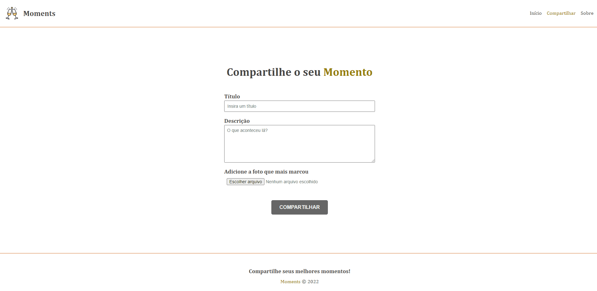

# Moments

Moments é uma aplicação que possibilita o registro de seus mais importantes. Adicione a descrição, insira uma foto e compartilhe a novidade. Pessoas poderão comentar e engajar a sua publicação.

Para este projeto foram utilizados:

- Angular v16.2.0
- Node: 16.18.0
- TypeScript
- HTML e CSS

Atenção: este repositório contém apenas o **front end** da aplicação **Moments.** Para acessar o back end responsável pela API, [clique aqui](https://github.com/matheusbattisti/curso_adonis_api_yt).

## ⚙️ O que você irá encontrar aqui

### Code

:heavy_check_mark: SPA utilizando o pacote de rotas nativo do Angular.

:heavy_check_mark: CRUD de momentos;

:heavy_check_mark: Filtro de momentos;

:heavy_check_mark: Inserção de comentários;

:heavy_check_mark: Formulário reativo e com validações

:heavy_check_mark: Biblioteca de ícones _Font Awesome_

## Iniciando a aplicação localmente

Execute `ng serve` para iniciar o servidor de desenvolvimento. A aplicação será inicializada na porta 4200, para visualizá-la acesse: `http://localhost:4200/`. A aplicação será recarregado automaticamente se você alterar qualquer um dos arquivos de origem.

Certifique-se de estar rodando localmente a API, para isso, volte no início desta documentação.
